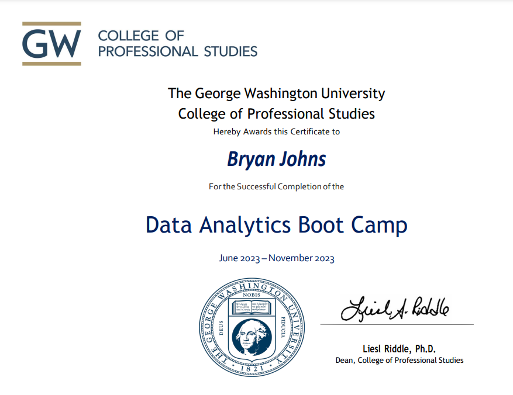

# Data-Analytics-Bootcamp-Exercises

This repository demonstrates my proficiency in modern data analytics workflows—from data ingestion and preprocessing to visualization, statistical modeling, and machine learning. It highlights both foundational and advanced techniques using industry-standard tools across real-world projects.

This repository contains class resources, coding examples, and exercises completed as part of the Data Analytics Bootcamp. The bootcamp curriculum focuses on foundational and advanced data analytics techniques, tools, and methodologies to solve real-world problems. This repository serves as a comprehensive showcase of the skills and knowledge gained throughout the program.

## Table of Contents
1. [Repository Structure](#repository-structure)
2. [Topics Covered](#topics-covered)
3. [Key Skills and Tools](#key-skills-and-tools)
4. [About the Bootcamp](#about-the-bootcamp)
5. [Program Certificate of Completion](#program-certificate-of-completion)
6. [Author](#author)

## Repository Structure

The repository is organized into the following folders:

- **0 Unsolved**: Contains exercises and activities that were not completed during the bootcamp.
- **3 Python**: Python programming fundamentals and applications.
- **4 Pandas**: Data manipulation and analysis using the Pandas library.
- **5 Matplotlib**: Data visualization techniques using Matplotlib.
- **6 API**: Working with APIs to retrieve and process data.
- **7 Stats and Git**: Statistical analysis, plus version control with Git.
- **9 PostgreSQL**: Database management and querying using PostgreSQL.
- **10 SQL Alchemy**: ORM techniques with SQLAlchemy.
- **11 Web Scraping**: Extracting data from websites using web scraping tools like Beautiful Soup.
- **12 NoSQL**: Working with NoSQL databases like MongoDB.
- **13 ETL**: Extract, Transform, Load processes for data pipelines.
- **14 JavaScript**: JavaScript programming for data visualization and interactivity.
- **15 Leaflet**: Interactive mapping with Leaflet.js.
- **16 Data Ethics**: Ethical considerations in data analytics.
- **18 Tableau**: Data visualization and storytelling with Tableau.
- **19 Unsupervised Learning**: Machine learning techniques for clustering and dimensionality reduction.
- **20 Supervised Learning**: Predictive modeling and classification techniques.
- **21 Neural Networks**: Deep learning fundamentals and applications.
- **22 Big Data**: Working with large datasets using tools like PySpark.
- **23 Convolutional Neural Networks**: Advanced deep learning techniques for image data.

## Topics Covered

### 1. **Python and Pandas**
- **Objective**: Learn Python programming and data manipulation using Pandas.
- **Key Skills**: Data cleaning, transformation, and exploratory data analysis.

### 2. **Data Visualization**
- **Objective**: Create compelling visualizations using Matplotlib, Seaborn, Plotly, Tableau, and JavaScript libraries.
- **Key Skills**: Chart creation, interactive dashboards, and storytelling with data.

### 3. **Databases and APIs**
- **Objective**: Work with relational and NoSQL databases, retrieve data using APIs, and perform web scraping.
- **Key Skills**: SQL queries, MongoDB operations, API integration, and web scraping with Beautiful Soup.

### 4. **Machine Learning**
- **Objective**: Apply supervised and unsupervised learning techniques.
- **Key Skills**: Clustering, classification, regression, and neural networks.

### 5. **Big Data**
- **Objective**: Analyze and process large datasets using PySpark and Databricks.
- **Key Skills**: DataFrames, SparkSQL, and distributed computing.

## Key Skills and Tools

Throughout the bootcamp, the following skills and tools were utilized:

- **Skills**: Data cleaning, exploratory data analysis (EDA), data visualization, statistical analysis, machine learning, and ethical data practices.
- **Tools**: Python (Pandas, NumPy, Matplotlib, Scikit-learn), SQL, Tableau, JavaScript (D3.js, Leaflet.js), MongoDB, PySpark, Databricks, Jupyter Notebook, Git & GitHub.

## About the Bootcamp

The Data Analytics Bootcamp is an intensive 6-month program designed to equip learners with the skills needed to analyze, visualize, and interpret data. The curriculum covers a wide range of topics, from programming and databases to machine learning and big data analytics.

This repository serves as a portfolio of the projects and skills developed during the program.

## Program Certificate of Completion

## Author

Bryan Johns
